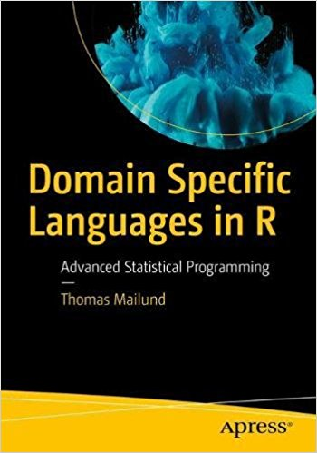

# Domain Specific Languages in R

This GitHub repository contains the source code from [**Domain Specific Languages in R**](https://amzn.to/2pTdfq5), by *Thomas Mailund* Apress; 1st ed. edition (October 6, 2018)
ISBN-10: 1484235878, ISBN-13: 978-1484235874.

The source code for each chapter can be downloaded as an R Markdown or an R source file from the links below.

1. Introduction
2. [Matrix expressions](Matrix-expressions/README.md) [[R source]](Matrix-expressions/README.R)
3. [Components of a programming language](Components-of-a-language/README.md) [[R source]](Components-of-a-language/README.R)
4. [Functions, expressions and operators](Functions-expressions-operators/README.md) [[R source]](Functions-expressions-operators/README.R)

